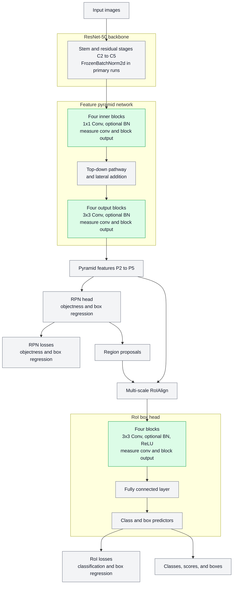

# Faster R-CNN, the two arms of the batch normalization experiment

Editable source for `faster-rcnn-bn-arms.svg`. The SVG is hand-authored from this diagram.

```mermaid
graph TB
    image[Input images] --> stem

    subgraph backbone[ResNet-50 backbone]
        stem[Stem and residual stages C2 to C5<br/>FrozenBatchNorm2d in primary runs]
    end

    stem --> inner

    subgraph fpn[Feature pyramid network]
        inner[Four inner blocks<br/>1x1 Conv, optional BN<br/>measure conv and block output]
        merge[Top-down pathway<br/>and lateral addition]
        output[Four output blocks<br/>3x3 Conv, optional BN<br/>measure conv and block output]
        inner --> merge --> output
    end

    output --> pyramid[Pyramid features P2 to P5]
    pyramid --> rpn[RPN head<br/>objectness and box regression]
    rpn --> rpnloss[RPN losses<br/>objectness and box regression]
    rpn --> proposals[Region proposals]
    pyramid --> roi[Multi-scale RoIAlign]
    proposals --> roi

    roi --> boxconv
    subgraph roihead[RoI box head]
        boxconv[Four blocks<br/>3x3 Conv, optional BN, ReLU<br/>measure conv and block output]
        boxconv --> boxfc[Fully connected layer]
        boxfc --> predictor[Class and box predictors]
    end

    predictor --> roiloss[RoI losses<br/>classification and box regression]
    predictor --> detections[Classes, scores, and boxes]

    classDef measured fill:#dcfce7,stroke:#16a34a,color:#111827;
    classDef fixed fill:#f3f4f6,stroke:#6b7280,color:#111827;
    class inner,output,boxconv measured;
    class image,stem,merge,pyramid,rpn,rpnloss,proposals,roi,boxfc,predictor,roiloss,detections fixed;
```
